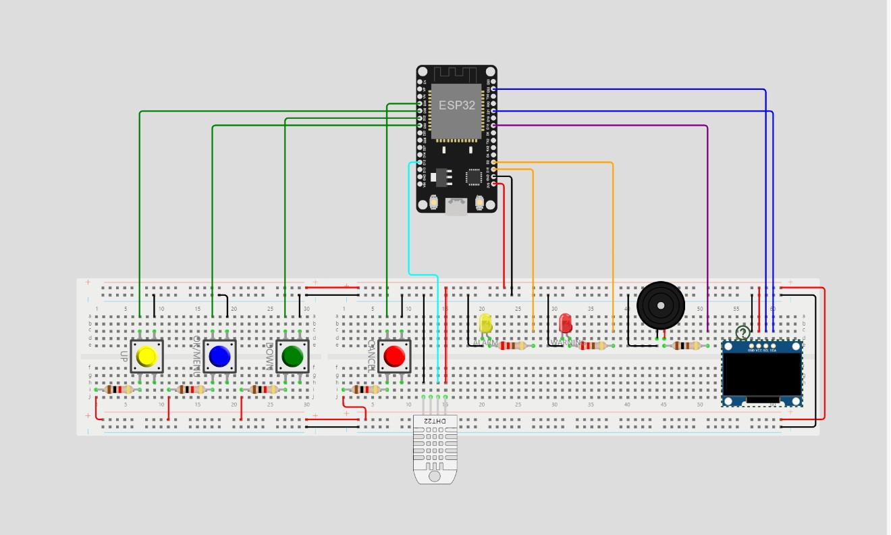
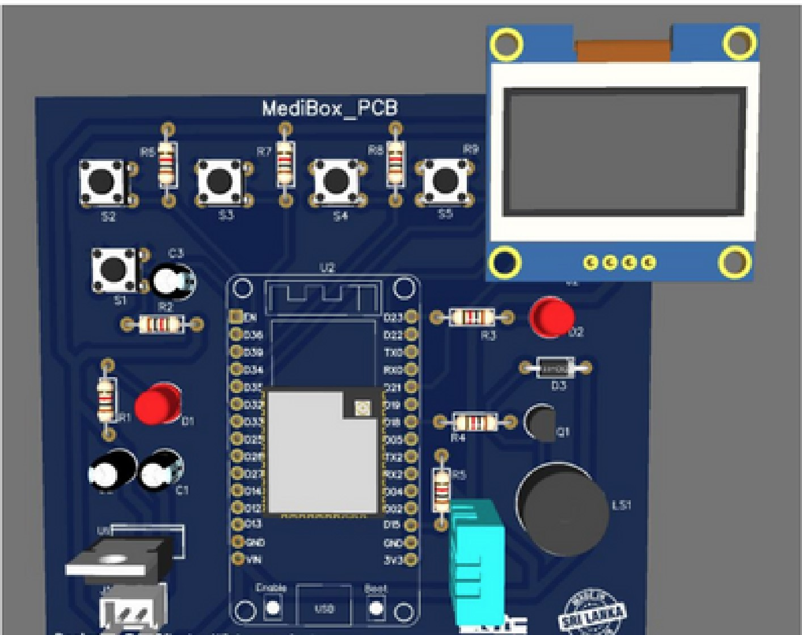
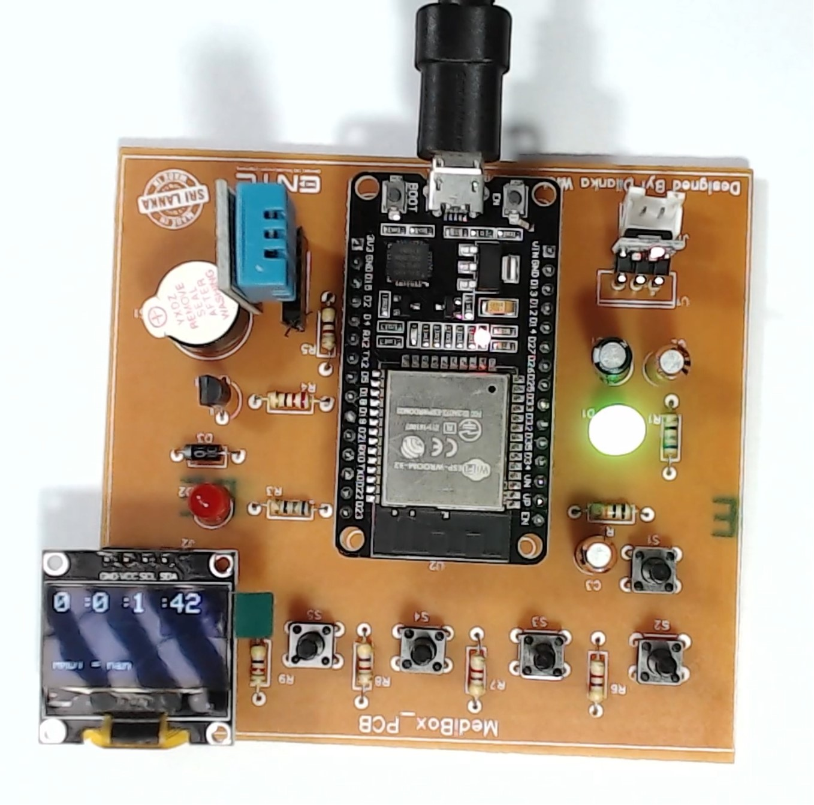

# Smart Medi Box using ESP32

## Description

This project aims to create a Medibox using an ESP32 microcontroller to remind users to take their medicine on time. It includes various functionalities such as setting time zones, alarms, disabling alarms, fetching time from NTP server, ringing alarms, and monitoring temperature and humidity levels.

## Functionality

- **Menu Options**
    - Set Time Zone: Allows users to input the offset from UTC to set their local time zone.
    - Set Alarms: Users can set up to three alarms for medication reminders.
    - Disable Alarms: Option to disable all alarms.

- **Time Fetching**
    - The device connects to an NTP server over Wi-Fi to fetch the current time in the selected time zone, which is then displayed on the OLED screen.

- **Alarm System**
    - When set alarm times are reached, the system will trigger an alarm with proper indications, which can be stopped using a push button.

- **Temperature and Humidity Monitoring**
    - The system constantly monitors temperature and humidity levels. If either or both exceed healthy limits, appropriate warnings are displayed on the OLED screen.

- **Indications**
    - Alarms and warnings are indicated through a combination of methods including a buzzer, LEDs, and OLED messages.

## Simulation

The simulation of this project was initially done on Wokwi. The code and simulation can be found [here](https://wokwi.com/projects/363553867401608193).

## Hardware Components

- ESP32 module
- DHT22 sensor
- 4 pushbuttons
- 2 LEDs
- Four 220Ω resistors
- Adafruit SSD1306 OLED display
- Buzzer

## Usage

To run this project, follow these steps:

1. [Connect the hardware components as per the circuit diagram or design a pcb]
2. [Clone or download the repository]
3. [Upload the code to your ESP32 board]

